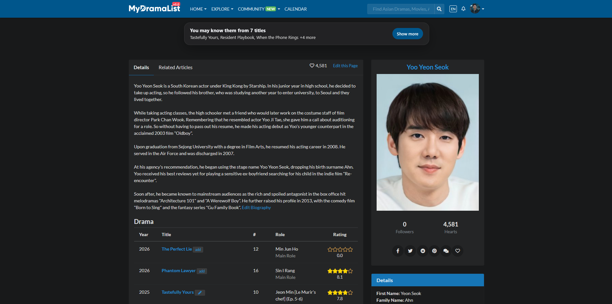
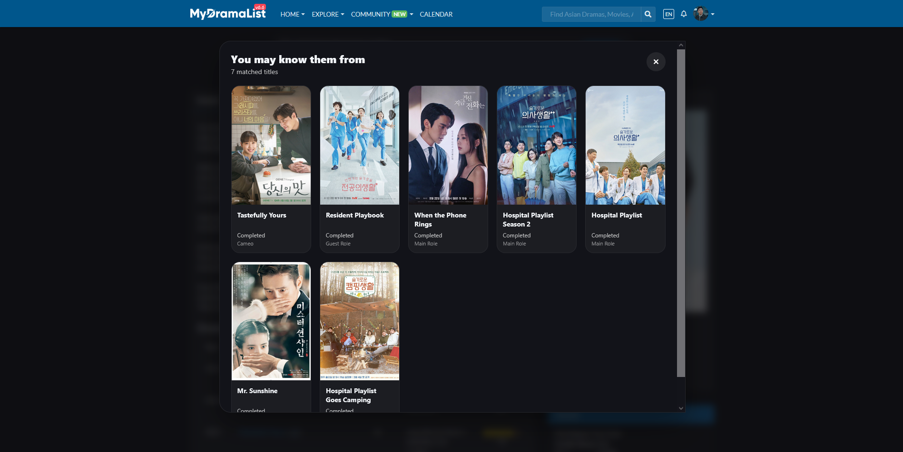
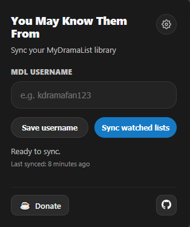

# You May Know Them From

A browser extension for MyDramaList that shows which titles from **your own MDL library** you know an actor, director, writer, or other credited person from.

Instead of scrolling through a full filmography and trying to remember where you have seen someone before, the extension surfaces your matching titles right at the top of the page.

## Why this exists

When watching a drama or a movie, there is a very common moment:

> “I know this actor from somewhere... but from where?”

This extension answers that instantly by comparing a person’s credits with the titles saved from your synced MyDramaList library. If you have already logged a drama, movie, or show they appeared in, you will see the match immediately! No need to scroll through their entire filmography every time.

## Quick start

1. Install the extension
2. Enter your MyDramaList username in the extension popup
3. Click **Sync watched lists**
4. Open any MyDramaList `/people/...` page (essentially any actor's, director's or crew's page)
5. If there are matches, the extension will show them at the top of the page
6. Click **Show more** to open the full modal

## Features

- Shows a **banner on top** of MDL 'people' pages with matched titles from your library
- Displays a **Show more** modal with posters, watch status, and role/credit labels
- Supports not only actors, but also optional **staff credits** (toggleable in settings), such as:
  - Director
  - Screenwriter
  - Writer
  - Original Creator
  - Executive Producer
  - Composer
  - Music Director
  - Cinematography
- Uses **high-resolution posters** inside the modal
- Caches posters locally for faster repeat viewing
- Lets you sync your MDL library directly from the extension popup
- Includes a small settings panel with:
  - toggle for staff credits
  - clear synced data
- Stores everything **locally** in browser storage

## Screenshots

### Banner on a person page

### Expanded “Show more” modal

### Extension popup

## Install

This extension is intended to be distributed through browser extension stores.

### Planned availability
- Chrome Web Store *(planned / coming soon)*
- Firefox Add-ons *(planned / coming soon)*

It can also be loaded manually as a developer extension from this repository.

## Browser support

The extension is designed for **desktop browsers**.

Current target support:
- Firefox
- Chromium-based browsers such as Chrome, Edge, and Brave

It is not intended for the MyDramaList mobile app.

## How it works

The extension does two main things:

### 1. Syncs your MyDramaList library

From the popup, you enter your MDL username and sync your watched lists.

The extension syncs these statuses:
- Completed
- Watching
- On Hold
- Dropped

The synced title data is stored locally in browser storage.

### 2. Matches credits on MDL people pages

When you open a MyDramaList `/people/...` page, the extension scans that person’s visible credits and compares them against your synced library across dramas, movies, specials, and TV shows.

If there are matches, it shows them in a banner at the top of the page.

When you open the **Show more** modal, the extension upgrades poster quality by fetching higher-resolution poster images from title pages and storing them in a local cache.

The modal also shows:
- the watch status for each matched title (`Completed`, `Watching`, `On Hold`, `Dropped`)
- the type of credit for that person (`Main Role`, `Support Role`, `Director`, `Writer`, etc.)

## Settings

The popup settings panel currently includes:

- **Include staff credits**  
  When enabled, the extension also checks non-acting credits such as director, writer, screenwriter, composer, and similar roles. This is enabled by default.

- **Clear synced data**  
  Removes your saved username, synced titles, last sync timestamp, and poster cache from local storage. This action requires confirmation.

## Privacy, storage, permissions and development notes

This extension stores data **locally in your browser** using `chrome.storage.local`.

Stored data may include:
- your MDL username
- synced title IDs
- synced title metadata
- last synced timestamp
- local poster cache
- staff-credit setting

The extension only needs access to:
- browser local storage, to save synced data, settings, and poster cache
- MyDramaList pages, to:
  - read credits from `/people/...` pages
  - sync list data from your MDL library pages
  - fetch poster images used in the modal

This project does **not** use a custom backend, external database, or server controlled by the project.
It is intentionally lightweight and currently uses plain JavaScript, HTML, and CSS.
That choice keeps the extension simple, fast, and easy to inspect while developing against a live website DOM.

## Current behavior notes

- The top banner shows 3 titles only. If a person has more than three matches, the remaining ones are visible after opening the **Show more** modal
- The banner preview favors recent matched titles
- The modal shows matched titles with watch status and credit labels
- High-resolution posters are loaded on demand when opening the modal
- On first open, lower-quality posters or missing posters may briefly appear before higher-resolution versions are fetched
- Posters are cached locally with a size limit to avoid unbounded storage growth

## Contributing

Issues and pull requests are welcome.

If you report a bug, it helps a lot if you include:
- browser name and version
- screenshots
- the MDL page URL
- what you expected to happen
- what actually happened

## Disclaimer

This project is an independent fan-made browser extension and is **not affiliated with MyDramaList**.

## License

MIT